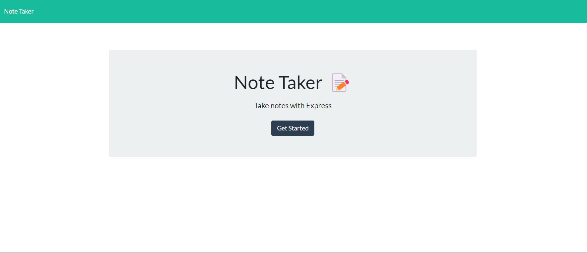

# TakeSomeNotes_Taker

## Welcome to TakeSomeNotes_Taker, an application created to assist you.

This is an application that utilizes Express to take some notes. There's a database json file that holds your notes, and when the server is started, your notes will be saved and shown onto the main page! you can also delete notes as you wish using the delete trash can button in the web .

### Preview

- 

## Table of Contents

- [Usage](#usage)
- [Installation](#installation)
- [License](#license)
- [Contribution](#contribution)
- [Tests](#tests)
- [Questions](#questions)

## Usage

Allows users to save notes, while studying or in a meeting using a server for convience

## Installation

npm init, npm i express jest nodemon crypto fs path

## License

[]

## Contribution

gsaaad

## Tests

jest

## Questions

If you have questions, email me @ : gsparqcode@gmail.com/ Github: [gsaaad](https://github.com/gsaaad)
